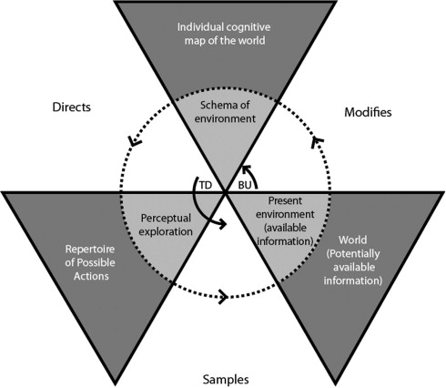

# Cognitive Ergonomics in Design

**COURSE**

---

## Introduction

> The origins of ergonomics relate to ***fitting the task to the person***

Cognitive ergonomics is about considering the impact of how people think, reason, understand
and act in design of all aspects of life, and use it to make better decisions when creating products.

Taking cognitive factors into account can prevent incidents and errors in systems. The example 
of the [**Three Mile Island**](https://en.wikipedia.org/wiki/Three_Mile_Island_accident) incident demontrastes the important of human factors.
In march 1979, bad design and bad user interfaces lead to human errors and then a nuclear incident. It was the most significant accident in
the U.S commercial nuclear power plant history (see chapter **Human error and automation** for more details).

The course is outlined with the following chapters:

- **Memory and attention**
- **Human workload**
- **Situation awareness**
- **Mental models**
- **Human error and automation**
- **Decision making and expertise**
- **Joint cognitive systems**

--- 

## Memory

### Memory structures

When trying to describe how the memory works, two types of structures can be noted:

- **Spatial**: memories are stored in a specific location, and *remembering* is a retrieval process involving a specific spatial search through the mind,
- **Parallel distributed processing**: memories stored in the form of connections among units and not stored in a single place.

### Memory models

More precisely, the memory presents many states, components and other elements that makes it more complex. Psychologist have been
trying to explain it through diverse models for many years. However critized, these models have influenced memory research.

#### Multi-store model

Proposed in 1968 by **Richard Atkinson** and **Richard Siffrin**, the multi-store model (or *modal model*) asserts that the memory is split
in three separate stores: **Sensory**, **Short-term** and **Long-term**.

The sensory stores describes the very brief availibility of memories related to envionmental stimulus. While it is generally
agreed that there is a sensory store for each sense, most of the research in the area has focused on the visual and auditory systems. The **iconic** store
refers to the visual system (delay of ~0.5 seconds, limited to the field of vision) and the **echoic** store focuses on the auditory system (delay of ~2 seconds). Unless attended, most of the information in sensory stores decays and is quickly forgotten.

When sensory memory is attended, it is transferred to the short-term store. This store holds information for a longer duration, but has a
very limited capacity: seven, plus or minus two items. However the short-term memory is susceptible to loss of information when
distracted. The duration can be extended if the information is **rehearsed**.

If that information is rehearsed thoroughly for a longer period of time, it is transferred to the long-term store. This store 
is more or less a permanent store that can hold information over extremely long periods of time. It is in fact assumed to be nearly
limitless in its duration and capacity. Information stored there can be transferred back to the short-term store where it can be
attended to and manipulated.

> **Criticism**: the modal model has been intensively critized over the following aspects:
>
> - Over simplified,
> - Evidence that the short-term probably behaves differently for different senses,
> - Fails to explain how information is really stored in the long-term store,
> - Focuses more on the structure instead of the actual process involved in memory and learning.

#### Working memory model

Proposed in 1974 by **Alan Baddely** and **Graham Hitch** proposed the working memory model in attempt to present a more
accurate model than the modal model by introducing a three part **working memory** replacing the short-term store. In 2000, they 
added a fourth component in the model. These components are:

- **Central executive**: acts as a supervisory system controlling the flow of information from and to its slave systems: the phonological loop and 
the visuo-spatial sketchpad,
- **Phonological loop**: stores information in a phonological form (speech-based, verbal content),
- **Visuo-visual sketch**: stores the spatial and/or visual data,
- **Episodic buffer**: conjoins information from the phonological loop and the visuo-visual sketch (visual, spatial and verbal information) with long-term memory (chronological information) into a single episodic representation (e.g. the memory of a story or a movie scene).

> **Advantages**: 
> 
> - Explains real world memory tasks (e.g. mental arithmetic, verbal reasoning),
> - Explains better the experiences of brain damaged patients,
> - Less focused on verbal rehearsal for retention.
> 
> **Disadvantage**: Difficulty to measure the capacity of the central executive.

### Long-term memory

The long-term memory does not store memories in one unified structure, as might be seen in a computer's hard disk drive. Instead, the long-term memory is typically divided into two major components: **explicit** memory and **implicit** memory.

#### Explicit memory

Also called the *declarative memory*, the explicit memory refers to all memories that are consciously available. It is the conscious, intentional recollection of factual information, previous experiences and concepts. People use explicit memory throughout the day, such as remembering the time of an appointment or recollecting an event from years ago. The explicit memory is divided in four major memory types:

- **Episodic**: storage and recollection of observational information attached to specific life-events (*someone's name*, *the memory of watching a movie*, *the memory of meeting someone*),
- **Semantic**: general world knowledge (facts, ideas, meaning and concepts) that can be articulated and is independant of personal experience (*languages*, *structures*, *classifications*, *objects*),
- **Autobiographical**: combination of episodic and semantic memory to contain the information on what the self is, what the self was, and what the self can be,
- **Spatial**: memory responsible for the recording of information about the environment and spatial orientation (*navigation*, *recognition of familiar places*, *map reading*).

#### Implicit memory

Also called the *procedural memory*, the implicity memory refers to the use of objects, or the movements of the body, generally to skills. It is acquired and used unconsciously, and can affect thoughts and behaviours. People use implicit memory every day such as tying their shoes or riding a bicycle, without consciously thinking about these activities.

### False memories

Evidence and studies have shown that although people are highly confident in their memories, the details of the memories can be forgotten and altered. A false memory is a phenomenon where a person recalls something that did not happen or differently from the way it happened. This phenomenon was initially investigated by the psychological pioneers **Pierre Janet** and **Sigmund Freud**. **Elizabeth Loftus** has since been a lead researcher in memory recovery and false memories. False memories can be created by suggestibility, activation of associated information, the incorporation of misinformation or source misattribution.

A common example to explain false memories is the case of the car crash and the distorted perceptions of it. In 1974, Loftus and Palmer conducted an experiment where they showed participants the video of a car crash. Later, they were asked questions about that same accident. The questions were asked differently to each participants, where for example a word in the question would change: "*About how fast were the cars going when they smashed/collided/bumped/hit/contacted each other?*". The results showed that the estimated speed was affected by the verb used. In addition, a week later, a question about the presence of broken glass on the accident was asked, and revealed that more participants that were asked the first question with the verb "*smashed*" remembered broken glass, although there was none.

### Flashbulb memory

A flashbulb memory is highly detailed, exceptionnally vivid "*snapshot*" of the moment and circumstances in which a piece of surprising and consequential news was heard. This type of memory include six main characteristic features: *place*, *ongoing activity*, *informant*, *own effect*, *other effect* and *aftermath*. Generally, the determinants of a flashbulb memory are a high level of surprise, a high level of consequentiality, and perhaps emotional arousal. An example of such a memory is the generally very detailed memories of the events of 9/11, and how many people remember exactly what they were doing the moment they learned about these events. 

Flashbulb memories however remain a controversial idea among psychologists, with some believing that these memories are not different from any other autobiographical memory because they rely on elements of personal importance, consequentiality, emotion and surprise. Other researchers believe it is an entirely distinct type of memory that forms differently and perhaps in different parts of the brain.

### Misplacing objects

Misplacing objects is something that happens very often to most individuals (Sarah Brill if you read this, big up to your Burgerking experience). Four main cognitive errors leading to misplaced objects are:

- **Absent-mindness**: mental condition in which a person experiences low levels of attention and frequent distraction (object put in unusual places),
- **Updating errors**: when a person cannot remember which of several usual places an object is in,
- **Detection failures**: when a person has an object in front of them but can't *detect* it,
- **Context effects**: distortions from other elements within the environment.

Common techniques to locate missing objects are: 

- **Action replay**: reconstruct sequence of actions,
- **Mental walk**: visualise possible object locations,
- **Reality monitoring**: generate images of placing the object in various locations and decide whether these correspond to reality,
- **Physical search**.

---

## Attention

Attention is the behavioral and cognitive process of selectively concentrating on a discrete aspect of information, whether deemed subjective or objective, while ignoring other perceivable information. Also described as the allocation of limited cognitive processing resources, attention remains a major area of investigation to determine the source of the sensor cues and signals that generate attention and the relationship between ofhter concepts like working memory and psychological vigilance.

### Types of attention

Attention is commonly split into four different types:

- **Selective**: ability to direct attention on several sources of information to determine whether a particular event has occured (*a doctor reading a hospital screen*),
- **Focused**: ability to direct attention on a single source of information without interruption or interference from either external or internal factors or stimuli (*a tennis court supervisor*),
- **Divided**: ability to direct attention to two or more separated tasks performed simultaneously (*cooking a meal*),
- **Sustained**: ability to continuously maintain focus on a task or event over a long period of time (*monitoring camera screen for security measures*).

### Attention models

#### Broadbent's filter model

In 1958, **Broadbent** proposed an attention model that postulates that physicial characteristics of messages are used to select one message for further processing and that all others are lost. This models proposes that information from all the stimuli at any given time enters an unilimited capacity sensory buffer, and is then filtered based on physical characteristics (*pitch*, *color*, *loudness*, *direction*). Because the human brain has a limited capacity to process information, this filter is designed to prevent the information-processing system from becoming overloaded. According to Broadbent the meaning of any of the messages is not taken into account at all by the filter.  All semantic processing is carried out after the filter has selected the message to pay attention to. So every message that is not attended would not be understood.

> **Criticism**: In addition to several criticism regarding the experiments that lead to the Broadbent's model (possible other explanations than the filter theory), a major issue with this model is that it does not account for the *Cocktail Party Effect*, because unattended messages are filtered out before the meaning can be processed (hearing someone call your name when not focused on it should then be impossible).

#### Treisman's attenuation model

In 1964, **Treisman** completes Broadbent's theory by specifying that the filter attenuates rather than eliminates the unattended material. This attenuation is like turning down the volume, so that if you have 4 sources of sound in one room, you can turn down or attenuate 3 in order to attend the fourth. This means that people can still process the meaning of unattended messages.

> **Criticism**: This model overcomes some of the Broadbent's model (the Cocktail Party Effect), but has been criticized regarding the lack of precision on the nature of the attenuation process and Treisman does not explain how exactly semantic analysis work.

#### Late selection model

In 1963, **Deutsch & Deutsch** proposed a model where all stimuli get processed in full, with the most important or relevant stimulus determining the response. In other words, they suggested that the selection does not occus on the basis of an early-selection filter, but after stimuli have already been identified. This theory hence locates the attentional filter later in the processing, after which all material processed upto this point ad judged to be most important is elaborated more fully.

> **Criticism**: The main criticism received for this theory is how wasteful it appears, with its thorough processing of all information before selection of admittance into working memory.

#### Capacity model

In 1973, **Kahneman** proposed a theory which is based around the idea of mental efforts. It proposes that some activities are more demanding and therefore require more mental effort than others. Kahneman thus believes in the existence of a Central Processor which operates a Central Allocation Policy, constantly evaluating the demands made by each task and adjusting attention accordingly. In addition, the total available processing capacities could be increased or decreased by  factors such as arousal

> **Criticism**: The main criticism for this theory ist that by developing skills, it would become impossible to accurately evaluate the demands required for each task and hence adjust attention accordingly.

#### Perceptual load model

In 1995, **Lavie** presented the perceptual load theory as a potential resolution to the early/late selection debate. Lavie attempts to resolve this debate by stating that both early and late selection occur varying on the stimulus presented. This variation in stimilus is explained as a notion of high or low perceptual load. This perceptual load refers to the complexity of the physical stimuli (particularly the distractor stimuli). Because Lavie gives the assumption that all of the attentional resources naturally have to be used up, a low load task would process more of the distractors to exhaust mental resources, and therefore the distractors would cause a greatee inference. On the other hand, in high load situations, as all the attentional resources are used up, distractors would cause less inference, if not at all. In other words, if the task-relevant stimulus uses all of the attentional resources, then none of the task-irrelevant stimuli (distractors) will be processed.

> **Criticism**: This theory has criticized regarding several points, notably how the notion of perceptual load is in fact dilution, and that this theory is not a solution t the early/late debate. A main critique is also how a visual cue can eliminate the inference effect supposedly created by perceptual load.

### Detection theory

In many taks that require thorough attention, the concept of signal detection plays an important part. Detection theory (1954) measures the ability to differentiate between information-bearing patterns (the signals) and random patterns that distract from the information (the noise). The theory states that characteristics such as experience, expectations, physiological state and other factors can affect the ability to detect relevant information. There are four possible outcomes when detecting:

| | Signal present | Signal absent
| -- | -- | --
| Signal detected | **Hit** | False alarm
| Signal not detected | Miss | **Correct rejection**

--- 

## Fitt's List

The Fitt's List, also known as HABA-MABA (*Humans Are Better At*-*Machines Are Better At*), is a list of statements regarding the abilities of humans and machines, which is used to determine the allocation of task assignment. In others words, it used to determine if a person or a machine could better a function required by a task or a system, with the ultimate goal to increase efficiency, safety, quality and profit-margins.

The first version of that list, from 1951, is the following table:

| HABA | MABA
| -- | --
| Detect a small amout of visual or acoustic energy | Quicly respond to control signals and apply great force smoothly and precisely
| Perceive patterns of light or sound | Perform repetitive tasks
| Improvise and use flexible procedures | Store information briefly and then erase it completely
| Store very large amounts of information for long periods and recall facts at the appropriate time | Reason deductively, including computational ability
| Reason inductively | Handle high complex operations at once
| Exercise judgement | 

Of course, multiple elements of that list are outdated, and hence a more recent one is presented (2017): 

| HABA | MABA
| -- | --
| Common sense | Natural language
| Dilemmas | Pattern identification
| Morals | Locating knowledge 
| Compassion | Machine learning
| Imagination | Eliminate bias 
| Dreaming | Endless capacity
| Abstraction | 
| Generalisation | 

--- 

## Human Workload

The workload is the notion of amount of labor, efforts, attention, focus and resources a human can manage while conducting a task. This concept is important because humans have limited capability for processing information, holding items in memory, making decisions and performing tasks. Excess workload can result in human performance issues such as slower task completion and errors such as slips, lapses or mistakes. Underload can also lead to issues such as boredom, loss of situation awareness and reduced alertness. These issues may be more relevant in critical times suchs as incidents.

### Measuring workload

It is hence important to be able to measure and assess mental workload in tasks to improve performance and reduce issues. There are four considerations to take into account to measure mental workload:

- **Sensitivity**: ability to detect changes in the workload experience by an operator,
- **Diagnosticity**: ability to understand the nature of changes in the workload,
- **Validity**: ensure that the measured changes in workload are not from external interferences,
- **Reliability**: stability and consistency of the measures,
- **Intrusiveness**: interference of the measure on the task performance leading to contaminated workload measures,
- **Usability**: ease of use (both for participat and experimenter),
- **Operator acceptance**: ensure that no change in performance is due to the operator awareness.

There are four aspects to measure to represent mental workload:

- **Primary task**: measuring how the nature of the main task and different demands impact performance,
- **Secondary task**: measuring how adding a secondary task (varying in difficulty) impact performance for both tasks,
- **Subjective**: self-report methods to measure workload from the operator's opinion,
- **Physiological/Psycho-physiological**: measuring changes in physiological parameters indicating changes in workload.

#### Primary task measures

When measuring the primary task, the main goal is to detect and understand changes in performance as demands are modified. The number of errors made, speed of performance or reaction time are frequently used as primary-task performance measures. There are several thorough methods to achieve this (*Analytic approach (Welford, 1978)* or *Synthetic method (Chiles & Allusi, 1979)*), but a combination of many is possible to obtain measurements of the workload.
It is important to note that primary measures can be unreliable, and that the workload can increase while performance remains unchanged. In addition, the specific individuals and taks involved in the measurement might also alter the results.

#### Secondary task measures

Adding a secondary task to the operator's primary task aims to discover the balance and allocation of workload, based on the fact that humans have a limited capacity to gather and process information. By looking at the performance of each task, the researcher can assess the operator's workload capacity. There are two way to do this: 

- **Loading**: the operator is instructed to avoid making errors on the secondary task. If the limit capacity is reached, then the primary task performance is degraded,
- **Non-loading**: the operator is instructed to avoid making errors on the primary task. The operator then tends to attend to the secondary task only when time is available.

It is important to take into consideration the intrusiveness of this measurement, as the secondary task will impact the general performance. In addition, primary and secondary tasks must use the same type of resources.

#### Subjective measures

Subjective measures refers to collecting information on the workload by asking the operators to rate the level of mental workload they felt to accomplish a task. This is done through self-reports methods such as interviews and questionnaires. These measures can be unidimensional (general index of the workload) or multidimensional (more in-depth measures assessing the nature of the workload). A multidimensional approach assumes that the workload is a complex phenomenon derived from multiple factors, and that the variations in the dimensions can be defined and evaluated more precisely. These measures will differ from individuals to others, as the emphasis on dimensions are different for each. 

An example of a multidimensional rating is the NASA-TLX scale, evaluating the mental demand, physical demand, temporal demand, effort, performance and frustration level of an indidividual. Another technique is the SWAT (*Subjective Workload Assessment Technique*) that splits the scale in dimensions of time load, mental effort load and psychological stress load.

#### Physiological measures

The physiological measures consist in using physical indicators to detect workload. For example, an elevated heart rate might indicate an intense activity, as could other indicators such as pupil diameter. A very thorough method is to examine brain waves, but is a very expensive and complex measurement. Other metrics such as body chemicals or auditory canal temperature can also be used.

### Wicken's multiple resources theory

In 1984, Wickens proposes a theory where the human operator does not have one single information processing that can be tapped, but several different pools of resources that can be tapped simultaneously. Depending on the nature of the task, these resources may have to process information sequentially if the different tasks require the same pool of resources, or can be processed in parallel if the task requires different resources. This theory allows system desigers to predict when:

- Tasks can be performed concurrently,
- Tasks will interefere with each other,
- Increases in the difficulty of onne task will result in a loss of performance of another task.

---

## Situation awareness

Situation awareness (SA) is the perception of environmental elements and events with respect to time or space, the comprehension of their meaning, and the projection of their future status. Situation awareness has become a foundation for succesul decision-making across a broad range of situations, including aviation, air traffic control, ship navigation, health care, emergency response, military command and control operations, and offshore oil and nuclear power plan management. Lacking or inadequate situation awareness has been identified as one of the primary factors in accidents attributed to human error.

Based on **Endlsey**'s model from 1995, situation awareness consists of three hierachical cognitive levels:

1. **Perception of the elements in the environment**: processes of monitoring, cue detection and simple recognition, awareness of multiple situational elements (objects, events, people, systems) and their current states (locations, conditions, modes, actions),
2. **Comprehension of the current situation**: processes of pattern recognition, interpretation and evaluation, understanding how perceived information will impact the goals and objectives (a comprehensive picture of the world),
3. **Projection of future status**: ability to project the future actions of the elements in the environment, determine how interpreted information will affect future states of the operational environment.

Situation awareness involved both an important temporal component, as it is a dynamic construct, changing at a tempo dictated by the actions of individuals, task characteristics, and the surrounding environment. As new inputs enter the system, the individual incorporates them into his mental representation, making changes as necessary in plans and actions in order to achieve the desired goals. In addition, situation awareness also involves spatial knowledge about the activities and events occuring in a specific ocation of interest to the individual. Thus, the concept of situation awareness includes perception, comprehension, and project of situational information, as well as temporal and spatial components.

### Factors

Endsley's model also illustrates several variables that can influence the development and maintenance of situation awareness. These factors can be divided into two categories:

- **Individual factors**: experience, training, abilities, knowledge, preconceptions, goals,
- **Task and environmental factors**: workload, stressors, system design, complexity.

These important factors demonstrates how simply providing the same system and training will not ensure situation awareness across different individuals. While this model provides the primary basis for decision making and performance in the operation of complex and dynamic systems, it cannot guarantee successful decision making. It is possible to have good situation awareness but make incorrect and poor performance, as it is possible to make good decisions leading to good performance with poor situation awareness.

In addition, other correlated cognitive concepts are factors to situation awareness:

- **Attention**: how an individual directs attention when acquiring and processing information has a fundamental impact, that can be affected by the individual's experience ad understanding of the system, as well as the physical characteristics of the environment,
- **Memory**: the working memory and its limits can constrain situation awareness, but the memory load can be reduced using meaningful chunks, information prioritisation or gistification of information. The long-term memory can also play an important part, in experts that develop internal models of the systems,
- **Workload**: situation awareness and workload are inter-related, independant constructs. The ultimate goal in system design is a high situation awareness combined with low workload.

### Measuring situation awareness

The multivariate nature of situation awareness poses a considerable challenge to its quantification and measurement. In general, techniques vary in terms of direct measurement (considered "*product-oriented*") or methods that infer ("*proccess-oriented*") situation awareness based on the operator behavior or performance. The main measures for situation awareness are:

- **Objective**: collecting data from the individual on his or her perceptions of the situation and compare them to what is actually happening. This type of assessment provides a direct measure of situation awareness, and can be gathered during the task (real-time), during a task interruption or after the completion of the task,
- **Subjective**: asking individuals to rate their own situation awareness through questionnaires or interviews. This technique is straightfoward and easy to implement, but limitations regarding the subjective assessments might not exploit the multivariate nature of situation awareness to provide a detailed diagnostic,
- **Performance and behavioral**: infering situation awareness from the end result (task performance, productivity, accuracy, number of errors), based on the assumption that better performance indicates better situation awareness. These measures can be collected objectively and intrusiveness, but evidence suggests that the connection between situation awareness and performance is not always direct and unequivocal, therefore not always reliable. Similarly, behavior meaures infer situation awareness from the actions that individuals choose to take, based on the assumption that good actions will follow from good situation awareness,
- **Process indices**: examining how individuals process information in their environement, such as by analyzing communication patterns between team members or using eye tracking devices. Verbal communication supports the knowledge bulding and informaton processing that leads to situations awareness construction. Physio-physiological measures can also be used to assess the relationship between human performance and changes in the operator's physiology (eyeblinks cardiac activity).

--- 

## Mental models

A mental model is an explanation of someone's though process about how something works in the real world. It is a representation of the surrounding world, the relationships betwen its various parts and a person's intuitive perception about his or her own acts and their consequences. Mental models can help shape behaviour and set an approach to solving problems and doing tasks. A mental model is a kind of internal symbol or representation of external reality, that plays a major role in cognition, reasoning and decision-making.

"*The image of the world around us, which we carry in our head, is just a model. Nobody in his head imagines all the world, government or country. He has only selected concepts, and relationships between them, and uses those to represent the real system.*" (Forrester, 1971).

### SKR framework

In 1983, Rasmussen proposed a framework that defines three types of behaviour of psychological processes present in operator information processing. This framework was developed to help designers combine information requirements for a system and aspects of human cognition. The three categories are:

- **Skill-based level**: also known as *sensorimotor behaviour*, a skill-based behaviour represents a type of behaviour that requires very little or no conscious control to perform or execute an action once an intention is formed (*riding a bike*),
- **Rule-based level**: characterised by the use of rules and procedures to select a course of action in a familiar situation (*following emergency instructions during a fire incident*),
- **Knowledge-based level**: a more advanced level of reasoning, employed when the sitation is novel and unexpected. A plan is developed using knowledge, reasoning and experience to predict the outcome of actions (*navigating in an unfamiliar environment*).

###  The knowledge in the head and world

In 1988, **Norman** presented the notion that not all knowledge required for precise behaviour doesn't have to be in the head. Instead, that knowledge is distributed, partly in the head, partly in the world, and partly in the constraints of the world. The way the knowledge and its properties are distributed between the head and the world is presented in the following table:

| Property | Knowledge in the world | Knowledge in the head 
| -- | -- | --
| Retrievability | Retrievable whenever visible or audible | Not readily retrievable, requires memory search or reminding
| Learning | Learning not required, substitued by interpertration | Requires learning, which is easier if there is meaning or structure to the material
| Efficiency of use | Tends to be slowed up by the need to find and interpret the external information | Can be very efficient
| Ease of use at first encounter | High | Low
| Aesthetics | Can be unaesthetic and inelegant, can lead to clutter

In addition, Norman presents the seven stages of action with knowledge:

1. Perceiving the state of the world
2. Interpreting the perception
3. Evaluation of interpretations
4. Goals
5. Intention to act
6. Sequence of actions
7. Execution of the action sequence

### Characteristics

Designers are interested in measures of learnability and ease of use. In this respect the notion of mental models has applicability and explanatory power. Mental models are what people really have in their heads and what guides their use of things. In other words, the designer designs a conceptual model into the system in order for it to appear graspable and coherent to the user. A mental model should integrate the following characteristics:

- **Feedback**: elements that clearly indicates changes in the state of a system. Feedback communicates the results of any interaction, making it both visible and understandable. It gives the user a signal that they have succeeded or failed at performing a task,
- **Consistency**: use of elements, rules and concepts that are consistent with already established designs to facilitate the use of the system. It is also about limiting the number of ways actions and operations are represented, ensuring that users do not have learn new representations for each task,
- **Visibility**: clear visual cues, easily readable and simplified,
- **Accessibility**: disposition of the different elements in an accessible configuration for all users,
- **Affordances**: properties that show the possible actions users can do, suggesting how they may interact with the system.

### Constraints

A user's understanding of how an object works is also based on the following constraints:

- **Natural, physical constraints**: the way in which an object can be moved, how it fits to other objects (*a kitchen closet door*),
- **Semantic constraints**: cues based on knowledge of the meaning of a situation (*a pen lid has to go where the ink can dry*),
- **Cultural constraints**: cues based on social conventions (*order of lights on a traffic light*),
- **Logical constraints**: cues based on a logical relationship between the spatial or function layout of components (*if there are only two buttons on a fan and one is used to turn it on, the other one is probably to turn it off*).

### Gestalt Laws

Gestalt laws of grouping, or the *principles of grouping* are a set of principles to account for the observation that humans naturally pereive objects as organized patterns an objects. Gestalt psychologists argued that these principles exist because the mind has an innate disposition to perceive patterns in the stimulus based on certain rules. These principles are organized into five categories:

- **Similarity**: suggests that similar objects tend to appear grouped together,
- **Pragnanz**: suggests that objects are seen in a way to makes them appear as simple as possible,
- **Proximity**: suggests that objects that are near each other seem to be grouped together,
- **Continuity**: suggests tat points that are connected by straight or curving lines are seen in a way that follows the smoothest path,
- **Closure**: suggests that objects are grouped together if they seem to complete some entity.

---

## Human error

Human error is an inappropriate or undesirable human decision or behaviour that reduces, or has the potential for reducing, effectiveness, safety or system performance. An error does not have to result in degraded system perofrmance or an undesirable effect on people to be considered an error. Human error theory aims to understand the nature and classification of these errors, and suggests considering the entire system and not only focus only the operator when errors occur.

### Classification

The first aspect to classify error is the difference between *active* and *latent* failures:

- **Active**: when the effects and consequences of the error are felt almost immediatly,
- **Latent**: when the error and its consequences may lie dormant for a long time.

Regarding the cognitive nature of the error, three main categories are considered:

- **Slips/Lapses**: when the correct way of performing an action is known, but often due to a lapse of attention, it is performed wrongly,
- **Mistakes**: use of an inappropriate action for the situation,
- **Violations**: deliberate decision to perform what is known to be an inappropriate or unsafe act.

The following diagram presents the classification of unsafe acts:

### GEMS

The Generic Error-Modelling System (GEMS) integrates, within the same framework, the different error mechanisms (slips, lapses, mistakes) and the three levels of performance (skill, rule, knowledge):

- **Skill-based**: *Slips* and *lapses*. These can be double-capture slips, omissions associated with interruptions, reduced intentionality, perceptual confusions, interference erros or overattention (omission, repetition, reversal),
- **Rule-based**: *Mistakes*. These can be misapplication of good rules or application of bad rules,
- **Knowledge-based**: *Mistakes*. These can be due to selectivity, workspace limitations, out of sight out of mind knowledge, confirmation bias, overconfidence, biased reviewing, illusory correlation, halo effects, causality issues, complexity issues, delayed feedback, insufficient consideration of processes in time.

---

## Automation

Automation refers to when a machine (usually a computer) assumes a task that is otherwise usually performed by a human operator. Automation is used in situations when the tasks are dangerous, impossible, challenging and when using a machine supports human performance and saves cost. There are three classes of automation: *Perception*, *Cognition* and *Control*.

There are 5 levels of decisions and action selection that a machine can assume in automation:

1. **None**: the human make all the decisions, without any support,
2. **Low**: the computer provides decisions support to the human to help ensure the decision is not unsafe,
3. **Medium**: the computer performs basic analysis and leaves perturbed modes to the human,
4. **High**: the computer performs mid-level analysis and has basic plans for implementation during perturbed operations,
5. **Full**: the computer makes all the decisions under all circumstances using complex algorithms to determine the optimal decisions and provides flexible plans for perturbed operations.

The general principles for a good automation are visibility, observability, understandability, directability, accountability, robustness, skill degradation, error resistant, error tolerant, reliability.

### Ironies of automation

In 1983, **Bainbridge** presented a paper discussing how automation might expand problems instead of eliminating them. Some of these ironies of automation are:

- Automation is never entirely autonomous and always requires an operator to do the remaining not-automated tasks,
- Skills, experience, expertise and long-term memory degradation,
- An operator is still required to monitor that the machine is effective.

There are more general issues with automation, such as:

- Reliability issues,
- Mistrust in system,
- Overtrust and complacency,
- Impact on operator workload,
- Job satisfaction.

---

## Decision making

Decision making is the cognitive process resulting in the selection of a choice among several alternative possibilities. Every decision-making process produces a final choice, which may or may not prompt action. The process of identifying and choosing alternatives is based on the values, preferences and beliefs of the decision-maker. Decision making is linked to several other cognitive factors such as *perception*, *working memory*, *attention*, *situation awareness* and *mental workload*. The flow of the decision making is usually cues leading to hypotheses generation and selection, to an action selection.

### Decision biases

Biases usually affect decision-making processes. They appear more when the decision task has time pressure, is done under high stress and/or when the task is highly complex. The heuristics and biases can be:

1. **Obtaining and using cues**: 
    - Attention to a limited number of cues,
    - Cue primacy,
    - Inattention to later cues,
    - Cue salience and prominence
    - Overweighting of unreliable cues,
2. **Hypothesis generation**
    - Limited number of hypotheses generated,
    - Availability heuristic (recency and frequency),
    - Representativeness heuristic (symptoms),
    - Overconfidence
3. **Hypothesis evaluation and selection**
    - Cognitive fixation
    - Confirmation bias
4. **Action selection**
    - Retrieve a small number of actions (working memory limited),
    - Availability heuristic for actions (recency, frequency, strength),
    - Availability of possible outcomes.

### Theories

#### Rational decision making

Rational decision making uses objective data, logic, and analysis instead of subjectivity and intuition to help solve a problem or achieve a goal. It's a normative step-by-step model that helps identifying a problem, picking a solution and finding an answer. The general steps are:

1. Define the problem,
2. Identify the decision criteria,
3. Allocate weights to the criteria,
4. Develop the alternatives,
5. Evaluate the alternatives,
6. Select the best alternative.

#### Prospect theory

Created in 1992 by Kahneman and Tversky, prospect theory describes the way people choose between probalistic alternatives that involve risk, where the probabilities of outcomes are uncertain. The theory states that people make decisions based on the potential value of losses and gains rather than the final outcome, and that people evaluate these losses and gains using heuristics. The model is descriptive: it tries to model real-life choices, rather than optimal decisions, as normative models do.

### Group decision making

Group decision making is a situation faced when individuals collectively make a choice from the alternatives before them. The decision is then no longer attributable to any single individual who is a memberof the group. This is because all the individuals ans social group processes such as social influence contribute to the outcome. The decisions made by groups are often different from those moade by individuals. While according to the idea of synergy, decisions made collectively tend to be more effective, there are many possible flaws and errors in group decision making:

- **Groupthink**: phenomenon that occurs within a group of people in which the desire for harmony or conformity in the group results in an irrational or dysfunctional decision-making outcome (trying to avoid conflict),
- Time, peer and leader pressure,
- Isolated decision-making,
- Inappropriate risk perception,
- Lack of deference to expertise.

--- 

## Expertise

An expert is someone who has a prolonged or intense experience through practice and education in a particular field. Informally, an expert i someones widely recognized as a reliable source of technique or skill whose faculty for judging or deciding rightly, justly, or wisely is accorded authority and status by peers or the public in a specific well-distinguished domain. The characteristics of an expert are vast sources of knowledge, organisational skills, and prolonged analysis competence.

### Expertise theory

Expertise theory specifies how talent develops across specified fields or domains, focusing on cognitive task analysis, instruction and practice, and clearly specified learning outcomes against which one can objectively measure the development of expertise. **Ericsson** established that expertise (and talent generally) appears to conform to orderly laws rather like those of classical learning theory. The amount of practice, coupled with quality curriculum and expert coaching, appears to predict the rate and ultimately limits of the development of expertise within a given domain. Ericsson suggest that the type of practice required to develop expertise is not simply doing work. It is a cognitively effortful activity in which on is thinking about what one is doing. It involves a reflective component, plus the opportunity to obtain feedback on the quality of the performance. Finally, in order to document the development of expertise, one must have clearly specified the learning outcomes agains which one can objectively measure its development.

Theories about expertise still present any issues, notably the fact that there seems to be a role for general intelligence, and that individual differences have a significant impact.

### Naturalistic decision making

In 1997, the naturalist decision-making (NDM) was originated as a means of studying how people use their experience to make decisions in real-world situations. This theory is specifically used in situatons marked by limited time, uncertainty, high stakes, team and organizational constraints, unstable conditions, and varying amounts of experience.

The recognition-primed decision (RPD) model is the main protocol derived from naturalistic decision making. This model describes how people use their experience in the form of patterns, that hihglight the relevant cues, provide expected outcomes, identify plausible goals and suggest typical types of reactions in that type of situation. When people need to make a decision, they can quickly match the situation to the patterns they have learned and experienced in the past, and in doing so, make rapid decisions. The RPD is represented by the following diagram:

--- 

## Joint Cognitive Systems 

The traditional view of Human-Machine systems tends to distinguish three separate elements: *human*, *machine* and *interface*. While these three are, in essence, different elements, considering a structural separateness implies a separation of processes and functions.  The characteristics of a disintegrated view of Human Machine Interaction present issues such as:

- Actions are treated as discrete events rather than as a continued flow of actions and events,
- Users are represented as single individuals, disregarding the fact that humans always depend on others,
- Focus is on response rather than on anticipation (human action si more than a combination of responses),
- Influence of situation or context is indiret ant limited to what can be considered as inputs,
- Models are structural and the emphasis is on the structure of the inner processing mechanisms rather tan on their function.

The concept of joint cognitive systems aims to solve many issues by considering HMI as a whole comprising people and technology acting together.

### Realities of work

When considering HMI with a disitingrated view, many cognitive and organisational factors are not taken into account, leading to performance issues, job strain and stress.

#### Yerkes-Dodson Law

In 1908, **Yerkes** and **Dodson** developed a law that is an empirical relationship between arousal and performance. It dictates that performance increases with physiological or mental arousal, but only up to a point. When levels of arousal become too high, performance decreases. Research has found that different tasks require different levels of arousal for optimal performance. For example, difficult or intellectually demanding tasks require a lower level of arousal to facilitate concentration, whereas tasks demanding stamina or persistence may be performed better with higher levels of arousal, to increase motivation. The Yerkes-Dodson law is usally represented by the following bell-shaped curve:

The upward part of the curve is usually thought of as the energizing effect of arousal, whereas the downward part is caused by negative effects of arousal (or stress) on cognitive processes like attention, memory and problem-solving. This demonstrates the need to see HMI as a whole, rather than distinct elements.

#### Job strain

In 1979, **Karasek** developed the Job Demand Control model, that presents an assesmment of stress and stress factors in the work environment and health promotion in the workplace. This model emphasises two important aspects:

- **Height of strain** (demands): the requirements that are set at work, including work rate, availability, time pressure, effort and difficulty. There are the psychological stressors in the work environment,
- **Decision latitude** (control): the freedom an employee has to control and organise his own work. This refers to the control employees have about their duties and how they want to perform theses taks. It consists of both competence and decision-making authority.

This model is represented with the following diagram:

An active job will lead to new behaviour patterns both on and off the job, while a passive job induces a decline in overall activity, a reduction in general problem solving, and may lead to feelings of learned helplessness. This model shows that the demands themselves do not lead to high psychological stress, it is about the combination of the demandes and the control that the job offers. Once again, seeing HMI as a whole would help limit these issues.

#### Transactional model of stress

In 1981, **Lazarus** and **Folkman** suggested that stress can be thought of as resulting from an imbalance between demands and resources, when pressure exceeds one's perceived ability to cope. Stress management was developed and premised on the idea that stress is not a direct response to a stressor but rather one's resources and ability to cope and mediate the stress response and are amenable to change, thus allowing stress to be controllable. The concept of Cognitive Appraisal, used in this transactional model, is the subjective interpretation made by an individual to stimuli in the environment. It is a component in a variety of theories relating to stress, mental health, coping and emotion. More specifically, cognitive appraisal is defined as the way in which an individual responds to and interprets stressors in life. 

**Cox**, in 1978, presented the concept of transactional of stress with the following diagram:

### Joint cognitive systems

Joint cognitive systems aim to avoid said issues by seeing the human-machine ensemble as a singe, joint system. This joint system implies harmony and co-operation, allowing for expansion with regard to multiple poeple or machines. This approach removes the need for representation of detailed processes internal to humans and machines. The characteristics of joint systems are:

- Actions are seen together and human behaviour is described as a coherent series of actions rather than as a collection of single responses,
- Focus on both anticipation and response,
- Users are seen as parts of the whole. The user and the environment are dynamically coupled, actions and events are mutually dependent,
- Influence of sitatuion or context is direct and affects the user's way of working, specifically how events are evaluated and how actions are selected.

#### Sensemaking

In 1979, **Weick** presents the concept of Sensemaking, the process by which people give meaning to their collective experiences. It is often formally defined as "the ongoing retrospective development of plausible images that rationalize what people are doing". Sensemaking moves beyond the hypothesis-acceptance/rejection approach to decision making and acknowledges the multiple influences on, ongoing nature and socially embedded character of realistic consideration of complex problems in a work context. Sensemaking can be simplified by the followig diagram:

#### Distributed cognition

Distributed cognition is a concept that proposes that cognition and knowledge are not confined to an individual, rather, it is distributed across objects, individuals, artefacts, and tools in the environment. Proposed by Hutchins in 1995, the goal of distributed cognition is to describe how dstributed units are coordinated by analyzing the interactions between individuals, the representational media used, ad the environment within which the activity takes lace. It is a useful descriptive framework that describes human work systems in informational and computational terms. Distributed cognition has implications for the design of technology in the mediation of the activity, because the system designers will have a stronger, clearer model of the work.