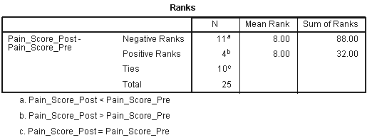
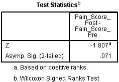
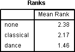

# Studying Human Performance - SPSS

**COURSE**

---

## Descriptive statistics

Descriptive statistics are used to **describe and summarise datasets**, and SPSS is very useful for the quick calculation of descriptive statistics. These can then be used for further calculations or displayed in a table or graph. The common descriptive statistics are **mean**, **mode**, **median**, **sum**, **maximum**, **minimum**, **standard deviation**, **range**, **variance**, **standard error of the mean**, **skweness** or **kurtosis**, **quartimes**, **percentiles**.

--- 

## Assumptions tests

### Levene

**Levene**'s test is an inferential statistic used to assess the equality of variances. It tests the null hypothesis that the population variances are equal (called homogeneity of variance or homoscedasticity). If the resulting p-value of Levene's test is less than some significance level (typically 0.05), the obtained differences in sample variances are unlikely to have occurred based on random sampling from a population with equal variances. Thus, the null hypothesis of equal variances is rejected and it is concluded that there is a difference between the variances in the population.

### Mauchly

**Mauchly's sphericity** is an important assumption of a repeated-measures ANOVA. It refers to the condition where the variances of the differences between all possible pairs of within-subject conditions are equal. If sphericity is violated, then the variance calculations may be distorted, which would result in an F-ratio that would be inflated. Sphericity can be evaluated when there are three or more levels of a repeated measure factor and, with each additional repeated measures factor, the risk for violating sphericity increases. To know if the sphericity is violated, the significance level is noted: **if \\(p < 0.05\\) the assumption of sphericity is reject**.

If the sphericity is violated, there are two main corrections to use to interpret the results:

- **Greenhouse-Geisser**,
- **Huynh-Feldt**.

A general rule of thumb presents the choices as follows:

### Normality

An assessment of the normality of data is a prerequisite for many statistical tests because normal data is an underlying assumption in parametric testing. There are two main methods of assessing normality: graphically and numerically.

Numerically, the tests **Kolmogorov-Smirnov** and **Shapiro-Wilk** are used:

Use **Shapiro-Wilk** for small samples (< 50) and **Kolmogorov-Smirnov** otherwise.

To interpret both tests, read the value of the significance value, **if p < 0.05, the data significantly deviates from a normal distribution**.

---

## Tests

### Wilcoxon

Just like when doing the calculations by hand, SPSS first ouputs a table with sum of **negative** and **positive** ranks. The cell **Ties** indicates how many subjects have been removed from the calculations because their rank difference was null. 

Then the next table shows that SPSS calculated what is called \\(W\\) when doing by hand, but has converted it to a **z-score**.

In this case, because the significance level is superior to 0.05, we fail to reject the null hypothesis.

> **REPORTING**: First conclude on the research question based on the significance level. Then present the results as such: **z = -1.807, p = 0.071**, and finally use descriptive statistics to support the result: the median.

--- 

### Mann-Whitney

Similarly to Wilcoxon, the first table for Mann-Whitney outputs the ranks, but for this test they are split by *group*. This first table
shows if there are differences between groups, that can afterwards be validated if the result is significant.

The next table shows the actual computation of the value \\(U\\):

In this case, because the significance level is inferior to 0.05, the null hypothesis can be rejected.

> **REPORTING**: First conclude on the research question, then present the results using the p-value such as **(p = 0.014)** and use the ranks to support the result.

--- 

### Friedman

The first table output is the **mean ranks** for each group/condition:

The next table shows the actual computation of the Friedman test, with the values Chi Square, dg, and the significance level:

In this case, because the significance level is inferior to 0.05, the null hypothesis can be rejected.

> **REPORTING**: First conclude on the research question based on the significance level, then present the results in this format: \\(\chi^2(df) = ..., p = ...\\) such as \\(\chi^2\\)**(2) = 7.600, p = 0.022**. Use the median of each condition to support the results. Finally, if the results are significant, a note on possible post hoc tests should be done. 

--- 

### Kruskal-Wallis

This test's ouput is very similar to Friedman's, except it shows the group distributions.

In this case, because the significance level is inferior to 0.05, the null hypothesis can be rejected.

> **REPORTING**: First conclude on the research question based on the significance level, then present the results in this format: \\(\chi^2(df) = ..., p = ...\\) such as \\(\chi^2\\)**(2) = 8.520, p = 0.014**. Use the mean rank of each condition to support the results. Finally, if the results are significant, a note on possible post hoc tests should be done. 

---

### T-Test (Within)

Also called **T-Test Dependant**, the first output of this test gives the **paired sample statistics**:

Then, the **paired samples test** table outputs the actual results of the T-Test:

In this case, because the significance level is inferior to 0.05, the null hypothesis can be rejected.

> **REPORTING**: First conclude on the research question based on the significance level, then present the results in this format: t(df) = t_value, p = p-value, such as **t(19) = -4.773, p < 0.0005** in this case. Use the descriptive statistics to support the results.

--- 

### T-Test (Between)

Also called **T-Test Independant**, the first output of this test gives the **group statistics**:

Thenext table **independant sample test** provides the actual results of the T-test:

With a p-value of 0.579 for the Levene's test, the samples have homogeneity of variance.

Regarding the T-test, the significance level of 0.020 indicates that the null hypothesis can be rejected.

> **REPORTING**: First conclude on the research question based on the significance level,then present the results in this format: t(df) = t_value, p = p-value, such as **t(38) = 2.428, p < 0.020** in this case. Use the descriptive statistics to support the results.

---

### One-Way ANOVA (Between)

First, the test outputs a table of descriptive statistics that gives valuable information:

Then, the ANOVA table is presented:

This table shows the **main effect**, that there is a significant difference between the group means. Here with p = 0.021 (< 0.05), that is validated and therefore there is a difference in the means. While this is important, the **simple effects** tells us more about which of the specific groups differ (done either with planned contrats or post hocs). The multiple comparisons shows this:

This table show the significances values between each group and here we can see that Beginner differs from Intermediate and Advanced (p = 0.46 and p = 0.34), while Indermediate and Advanced present no significant difference (p = 0.989).

> **REPORTING**: First conclude on the research question based on the significance level and the F-ratio as follows: F(df_between, df_within) = F_value, p = p_value, such as **F(2, 27) = 4.467, p = 0.021**. Present the results found with constrasts/post hocs using the p-values and use the mean to support it.

---

### One-Way ANOVA (Within, Repeated Measures)

The first table output is the **within-subjects factors** which confirms the study design of our analysis, these are the experimental conditions:

Then, just like for the Between ANOVA, a table of descriptive statistics is shown:

The next stable is the actual results of the test:

It is important (using mauchly's test) to know which result source to read from. Here, because the assumption of sphericity is violated, the Greenhouse-Geisser correction is used. With a significance level of 0.000-, the null hypothesis can be rejected. While this is important, the **simple effects** tells us more about which of the specific level differ (done either with planned contrats or post hocs). The pairwise comparisons shows this: 

Again, the significance values shows where differences are present between the conditions.

> **REPORTING**: First conclude on the research question based on the significance level and the F-ratio as follows: F(df_between, df_within) = F_value, p = p_value, such as **F(2, 27) = 4.467, p = 0.021**. Present the results found with constrasts/post hocs using the p-values and use the mean to support it.

--- 

### Two-Way ANOVA (Between/Within)

These tests are similar and the process is similar, only with more IVs, hence more combinations and more possible comparisons.