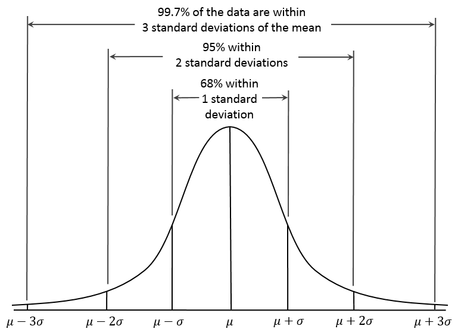

# Studying Human Performance - Statistics

**COURSE**

---

## Basics

### Data types

There are three types of data to consider when doing statistics:

- **Categorical**: data classed into categories,
- **Ordinal**: data that can only be classed by order,
- **Ratio/Interval**: data that can be put on a scale where the relationship between each point is known.

### Measures of central tendency

There are three measures of central tendency to take into account: *mean*, *median* and *mode*.

The **mean** is the average of all numbers and is sometimes called the *arithmetic mean*, and is generally best for *interval* data. In a sample with \\(n\\) elements such as \\(x_1, x_2,..., x_n\\), the mean noted \\(\bar{x}\\) is the sum of all the values divided by the numbers of items:
\\[\bar{x} = \frac{1}{n} \cdot \sum_{i=1}^{n} x_i\\]

The **median** is the value separating the higher half from the lower half of a data sample, commonly thought of as the "*middle*" value. 
Finding the median in a sample only requires the sample to be ranked (sorted, ordered). The median is best to use with *ordinal data*. The basic advantage of the median compared to the mean is that it is not skewed so much by extremely large or small values, and so it may give a better idea of a "*typical*" value.

The **mode** of a set of values is the value that appears most often, the most common entry, best measure for *categorical data*.

---

## Normal distribution

### Definition

The **normal distribution** (also called *Gaussian* or the *bell curve*), is a very common continuous probability distribution. Normal distributions
are very important in statistics and are often used to represent real-valued random varaibles whose distributions are not known.
The normal distribution is useful because of the **central limit theorem** stating that averages of samples converge in distribution to the normal, that is,
they become normally distributed when the number of observations is sufficiently large.

In simpler words, when observing data from large samples, in many cases, the data tends to be around a central value with no bias left or right. This 
distribution is found in many naturally occurring phenomena such as *heights of people*, *size of objects produced by machines*, *errors in measurements*, *blood pressure*, *marks on a test* and many more. The properties of a normal distribution allow to easiliy manipulate variables and compute significant results. 

A normally distributed sample is a sample with equal measures of central tendecy, that is when \\(mean = median = mode\\). When this is not the case, the data sample is said to be **skewed**. A sample can be negatively skewed (\\(mean < median < mode\\)) or positively skewed (\\(mean > median > mode\\)). It is not appropriate to perform various statistical tests on a skewed sample. When the sample is normally distributed with a perfect symetry, exactly 50% of the values are lower than the mean, and exactly 50% are higher.

A normal distribution is noted \\(\mathcal{N}(\mu, \sigma)\\) with \\(\mu\\) the mean, \\(\sigma\\) the standard deviation and \\(\sigma^2\\) the variance.

### Standard deviation

The standard deviation, note \\(\sigma\\), is a measure defining how **spread out** the numbers of a sample are. A low standard deviation indicates that the data points tend to be **close to the mean**, while a high standard deviation indicates that the data points are **spread out over wider range of values**. This measure is the **square root of the variance**. But what is the variance?

The **variance** is defined as the **squared differences from the mean**. Informally, the variance measures how far a set of numbers are spread out from their average value. For a sample with \\(n\\) values, it is calculated with the following formula:
\\[\sigma^2 = \frac{\sum_{i=1}^{n} (x_i - \mu)^2}{n-1}\\]

The **standard deviation** is therefore calculated with:
\\[\sigma = \sqrt{\frac{\sum_{i=1}^{n} (x_i - \mu)^2}{n-1}}\\]

Once the mean and the standard deviation are known, a perfect description of the distribution is given. Generally we find that:

### Standard scores

The standard deviation is a useful tool to generally examine a sample and contextualize values in 1 to 3 standard deviation units from the mean. However, how to know how many standard deviations a specific value is from the mean? 

To convert a value to a standard deviation value (also called a **standard score** or **z-score**):

- **Substract** the mean to the value (*how far from the mean?*),
- **Divided** by the standard deviation (*how many standard deviations?*).

Hence for a value \\(x\\), the z-score \\(z\\) is:
\\[z = \frac{x - \mu}{\sigma}\\]

Doing that operation is called **standardizing**, or converting a *normal distribution* into a *standard normal distribution*. Usually, the entire sample
is standardized at once to simplify the calculations by simply looking up standardized pre-computed tables. The table **D. Normal distribution table** allows
to convert from standard scores to percents, and vice versa.

-- 

## Statistical tests

When doing an experiment, choosing the correct statistical test is very important to obtain significant results. The first step
in doing so is to understand every factor affecting the choice, and how to implement **study design**.

### Experiment outline

An experiment, (or study or research), can be outlined by the following steps:

1. **Research question**: objective, aim, question asked,
2. **Study design**: describing the experiment through hypothesis, variables, data types and participants,
3. **Test selection**: choosing the correct test(s) based on the study design,
4. **Conducting the experiment**: doing the described experiment and collecting data,
5. **Doing the test**: using the data to obtain results through the selected test(s),
6. **Interpretation and conclusion**: making sense of the result and concluding on the research question.

### Study design

#### Defining the problem, aim and hypotheses

The first step in designing a study is to clearly define the problem and issues that require investigation, and what will
be achived by doing it. This is usually represented by a system of **hypotheses**, or *statements of the predicted outcome*. As 
studies manipulate variables and data, the aim of these hypotheses is to predict, understand and validate the relationships between said variables.
Conventionally, there are two types of hypothesis:

- **Experimental**, or *H1*, that predicts a dependent relationship between variables,
- **Null**, or *H0*, that states that variables are not dependent (one does not impact the other).

#### Identify the research variables

The said variables are split in three categories:

- **Independant variables** (*IV*): variables manipulated by the experimented, related to the individual, task, system or environment,
- **Dependant varaibles** (*DV*): varaibles being measured in the experiment, not under the control of the experimenter, possibly affected by the IVs,
- **Controlled variables**: variables that need to be kept constant during the experiment.

#### Allocate participants to the experimental conditions

There are two ways to allocate and distribute the participants across the IVs:

- **Within**: every participant completes every experimental condition,
- **Between**: different participants are allocated to each experimental condition.

#### Assumptions

The experimental hypothesis predicts a dependant relationship between variables, or in other words, independant variables impacting dependant variables. 
A study design can however further predictions by using **assumptions**.

A **one-tailed** hypothesis predicts *how* and in *which direction* an independant variable impacts a dependant variable. For example, if an experimental hypothesis predicts that *music* (IV) impacts *performance* (DV), a one-tailed extension would add that *music* **improves** *performance*, or that *music* **impairs** *performance*. One-tailed tests must be justified: it is for example justified to predict that constant loud noise impairs performance.

In addition, **contrasts** are other assumptions that can be integrated to a study design. Unlike one-tailed assumptions that predict in *which direction* an independant variable affects a dependant variable, contrasts compare the **levels** of an independant variable. For example, if an experimental hypothesis predicts that *music* (IV) impacts *performance* (DV), and that this independant variable has three levels (*classical*, *rock*, *rap*), contrasts could be that *classical* music affects *performance* differently than *rap music*.

#### Data types and analysis

Based on the data types and the variables, a test can either be **parametric** or **non-parametric**.

A **parametric test** is a test that is carried out with the assumption that the data collected follows a well-known distribution (usually the normal distribution), which can be boiled down to the knowledge of just a couple of **parameters**. A parametric test provides generalisations for making statements about the mean of the parent population. Because parametric test are based on a distribution, the measurement of varaibles on **interval** or **ratio** level, with the mean used as the measure of central tendency.

On the other hand, a **non-parametric test** has no know information about the population and is not based on any known distribution. Because non-parametric tests don't require assumptions about the nature of their distributions, they are also called **distribution-free**. These tests hence assume that the variables are measured on a **nominal** (categorical) or **ordinal** level, with the median as the measure of central tendency.

### Significance

Statistical tests try to answer a question, based on the available data. When rejecting a null hypothesis (observing that there is indeed a relation between variables), there is a probability that this rejection is due to **chance**, that the random variables happen to **misrepresent the reality**. This probability, called **p-value**, represents the chance to reject a null hypothesis when it is **actually true**. Subsequently, the lower the p-value, the more meaningful the result because it is less likely to be caused by **noise**. 

The action to reject the null hypothesis when it is actually true is called an **incorrect conclusion** and more precisely a **Type I error**. It is an experimental error that analysts wants to **avoid** in priority, to not make any false claim. To that end, before conducting the test, a **significance threshold** called \\(\alpha\\) is set, that if exceeded, indicates a non-significant result. That threshold is usually \\(\alpha = 0.05\\), but particular contexts and fields of study often require a more strict value, such as \\(\alpha = 0.001\\).

Of course, the opposite action of **failing to reject a null hypothesis** when it is **actually false** is another experimental error called **Type II error**, but is often seen as less serious than the Type I error. The chance to make a Type II error is represented by the probability called \\(\beta\\). The **statistical power** is the probability of correctly rejecting the null hypothesis, because it is **indeed false**.

---

## Non-parametric tests

### Wilcoxon

`One IV, Two Levels, Within`

A set of \\(N = 12\\) subjects are asked to rate two designs of screwdriver handle for ease of use on a seven point ordinal scale **(7 = easiest, 1 = most difficult)** and the data obtained are shown in the table below:

| Subject | Handle A (\\(X_1\\)) | Handle B (\\(X_2\\))
| -- | -- | --
| S1 | 6 | 3
| S2 | 5 | 6
| S3 | 7 | 4
| S4 | 4 | 4
| S5 | 6 | 5
| S6 | 4 | 1
| S7 | 3 | 5
| S8 | 5 | 2
| S9 | 7 | 2
| S10 | 5 | 2
| S11 | 6 | 2
| S12 | 6 | 4

First start by **calculating the differences between each pair of scores**:

| Subject | Handle A (\\(X_1\\)) | Handle B (\\(X_2\\)) | \\(X_1\\) - \\(X_2\\)
| -- | -- | -- | --
| S1 | 6 | 3 | 3
| S2 | 5 | 6 | -1
| S3 | 7 | 4 | 3
| S4 | 4 | 4 | `0`
| S5 | 6 | 5 | 1
| S6 | 4 | 1 | 3
| S7 | 3 | 5 | -2
| S8 | 5 | 2 | 3
| S9 | 7 | 2 | 5
| S10 | 5 | 2 | 3
| S11 | 6 | 2 | 4
| S12 | 6 | 4 | 2

The next step is to **ignore null differences** (such as for S4), and hence decrease to \\(N = 11\\) subjects. The differences
must then be ranked in order of magnitude (take mean for similar differences) in \\([1, N]\\), as follows:

<table align="center">
    <thead>
        <th>Order</th>
        <th style="text-align: center;">1</th>
        <th style="text-align: center;">2</th>
        <th style="text-align: center;">3</th>
        <th style="text-align: center;">4</th>
        <th style="text-align: center;">5</th>
        <th style="text-align: center;">6</th>
        <th style="text-align: center;">7</th>
        <th style="text-align: center;">8</th>
        <th style="text-align: center;">9</th>
        <th style="text-align: center;">10</th>
        <th style="text-align: center;">11</th>
    </thead>
    <tr>
        <td>Difference</td>
        <td style="text-align: center;">1</td>
        <td style="text-align: center;">1</td>
        <td style="text-align: center;">2</td>
        <td style="text-align: center;">2</td>
        <td style="text-align: center;">3</td>
        <td style="text-align: center;">3</td>
        <td style="text-align: center;">3</td>
        <td style="text-align: center;">3</td>
        <td style="text-align: center;">3</td>
        <td style="text-align: center;">4</td>
        <td style="text-align: center;">5</td>
    </tr>
    <tr>
        <td>Rank</td>
        <td style="text-align: center;" colspan="2">1.5</td>
        <td style="text-align: center;" colspan="2">3.5</td>
        <td style="text-align: center;"colspan="5">7</td>
        <td style="text-align: center;">10</td>
        <td style="text-align: center;">11</td>
    </tr>
</table>

Then, assign in the previous table the rank to each difference, **conserving their sign**:

| Subject | Handle A (\\(X_1\\)) | Handle B (\\(X_2\\)) | \\(X_1\\) - \\(X_2\\) | Rank
| -- | -- | -- | -- | --
| S1 | 6 | 3 | 3 | 7 (+)
| S2 | 5 | 6 | -1 | 1.5 (-)
| S3 | 7 | 4 | 3 | 7 (+)
| S4 | 4 | 4 | `0`
| S5 | 6 | 5 | 1 | 1.5 (+)
| S6 | 4 | 1 | 3 | 7 (+)
| S7 | 3 | 5 | -2 | 3.5 (-)
| S8 | 5 | 2 | 3 | 7 (+)
| S9 | 7 | 2 | 5 | 11 (+)
| S10 | 5 | 2 | 3 | 7(+)
| S11 | 6 | 2 | 4 | 10 (+)
| S12 | 6 | 4 | 2 | 3.5 (+)

Calculate the total of negative ranks \\(T_n\\) and the total of positive ranks \\(T_p\\):

- \\(T_n = 5\\)
- \\(T_p = 61\\)

Finally, select from these two totals the **lowest one**, that is the value \\(W_{obs}\\). In this example \\(min(T_n, T_p) = 5\\), therefore \\(W_{obs}  = 5\\).

In the table **A**, search for \\(N = 11\\), with a level of significance for a two-tailed test of \\(\alpha = 0.05\\), that value is \\(W_{crit} = 11\\).

Because \\(W_{obs} < W_{crit}\\), **the null hypothesis is rejected** (there is a difference of ease of use between the two designs of handles).

---

### Mann-Whitney

`One IV, Two Levels, Between`

Two groups of 7 subjects (total of \\(N = 14\\)) are asked to complete a maintenance task using either a **paper based** manual for instructions or a **head mounted display** on a “private eye”.  After the task they rate how **easy** they found several aspects of the task, giving an overall usability rating of between 4 and 20 **(20 = easiest to use, 4 = most difficult)**.

| **Subject** | Paper based | **Subect** | Private eye
| -- | -- | -- | --
| **S1** | 8 | **S8** | 11
| **S2** | 10 | **S9** | 15
| **S3** | 6 | **S10** | 18
| **S4** | 15 | **S11** | 14
| **S5** | 14 | **S12** | 16
| **S6** | 9 | **S13** | 12 
| **S7** | 10 | **S14** | 9

First rank the scores by order of magnitude (take mean for similar differences) in \\([1, N]\\) as follows:

<table align="center">
    <thead>
        <th>Order</th>
        <th style="text-align: center;">1</th>
        <th style="text-align: center;">2</th>
        <th style="text-align: center;">3</th>
        <th style="text-align: center;">4</th>
        <th style="text-align: center;">5</th>
        <th style="text-align: center;">6</th>
        <th style="text-align: center;">7</th>
        <th style="text-align: center;">8</th>
        <th style="text-align: center;">9</th>
        <th style="text-align: center;">10</th>
        <th style="text-align: center;">11</th>
        <th style="text-align: center;">12</th>
        <th style="text-align: center;">13</th>
        <th style="text-align: center;">14</th>
    </thead>
    <tr>
        <td>Score</td>
        <td style="text-align: center;">6</td>
        <td style="text-align: center;">8</td>
        <td style="text-align: center;">9</td>
        <td style="text-align: center;">9</td>
        <td style="text-align: center;">10</td>
        <td style="text-align: center;">10</td>
        <td style="text-align: center;">11</td>
        <td style="text-align: center;">12</td>
        <td style="text-align: center;">14</td>
        <td style="text-align: center;">14</td>
        <td style="text-align: center;">15</td>
        <td style="text-align: center;">15</td>
        <td style="text-align: center;">16</td>
        <td style="text-align: center;">18</td>
    </tr>
    <tr>
        <td>Rank</td>
        <td style="text-align: center;">1</td>
        <td style="text-align: center;">2</td>
        <td style="text-align: center;" colspan="2">3.5</td>
        <td style="text-align: center;" colspan="2">5.5</td>
        <td style="text-align: center;">7</td>
        <td style="text-align: center;">8</td>
        <td style="text-align: center;" colspan="2">9.5</td>
        <td style="text-align: center;" colspan="2">11.5</td>
        <td style="text-align: center;">13</td>
        <td style="text-align: center;">14</td>
    </tr>
</table>

Assign the rank to each score in the previous table and compute the totals:

| **Subject** | Paper based | Rank | **Subect** | Private eye | Rank
| -- | -- | -- | -- | -- | --
| **S1** | 8 | 2 | **S8** | 11 | 7
| **S2** | 10 | 5.5 | **S9** | 15 | 11.5
| **S3** | 6 | 1 | **S10** | 18 | 14
| **S4** | 15 | 11.5 | **S11** | 14 | 9.5
| **S5** | 14 | 9.5 | **S12** | 16 | 13
| **S6** | 9 | 3.5 | **S13** | 12 | 8
| **S7** | 10 | 5.5 | **S14** | 9 | 3.5
| **TOTAL** |  | **38.5** | |  | **66.5**

The total rank for *paper based* is \\(T_{pb} = 38.5\\), and the total rank for *private eye* is \\(T_{pe} = 66.5\\).

Select from the two rank totals the **highest one** and assign to the variable \\(T_x\\).
\\[T_x = max(T_{pb}, T_{pe}) = 66.5\\]

Using the following formulate, calculate the value of \\(U_{obs}\\):

\\[U_{obs} = n_1 \cdot n_2 + \frac{n_x \cdot (n_x + 1)}{2} - T_x\\]

where:

- \\(n_1\\) is the number of subjects in the group 1 (here \\(n_1 = 7\\)),
- \\(n_2\\) is the number of subjects in the group 2 (here \\(n_2 = 7\\)),
- \\(n_x\\) is the number of subjects in the group with the the highest rank total (here \\(n_x = 7\\)).

Therefore:

\\[U_{obs} = 7 \cdot 7 + \frac{7 \cdot (7 + 1)}{2} - 66.5 = 10.5\\]

In the table **B**, search for \\(n_1 = n_2 = 7\\), with a level of significance for a two-tailed test of \\(\alpha = 0.05\\), that value is \\(U_{crit} = 8\\).

Because \\(U_{obs} > U_{crit}\\), we fail to reject the null hypothesis (it can't be said that there is a difference between the two conditions).

--- 

### Friedman

`One IV, Three+ levels, Within`

A group of \\(n = 6\\) students are asked to use three different types of computer interface one which is solely **command line** based, one which uses a **combination** of command line and pull down menus, and one which only uses pull down **menus**. They are then asked to rate the usability of these interfaces on a five point scale **(5 = most usable)**.  The following scores are obtained:

| Subject | Cmd line | Combination | Menus
| -- | -- | -- | --
| S1 | 2 | 4 | 2
| S2 | 1 | 5 | 3
| S3 | 3 | 5 | 2
| S4 | 2 | 3 | 3
| S5 | 2 | 4 | 3
| S6 | 1 | 3 | 4

For each separate subect, rank the three scores by order of magnitude as follows for **Subject 1 (S1)**:

<table>
    <thead>
        <th>Order</th>
        <th style="text-align: center;">1</th>
        <th style="text-align: center;">2</th>
        <th style="text-align: center;">3</th>
    </thead>
    <tr>
        <td>Score</td>
        <td style="text-align: center;">2</td>
        <td style="text-align: center;">2</td>
        <td style="text-align: center;">4</td>
    </tr>
    <tr>
        <td>Rank</td>
        <td style="text-align: center;" colspan="2">1.5</td>
        <td style="text-align: center;">3</td>
    </tr>
</table>

Assign the ranks to every score in the previous table and compute the rank totals:

|  | Cmd line | | Combination | | Menus | |
| -- | -- | -- | -- | -- | -- | -- 
| **Subject** | **Score** | **Rank** | **Score** | **Rank** | **Score** | **Rank**
| S1 | 2 | 1.5 | 4 | 3 | 2 | 1.5
| S2 | 1 | 1 | 5 | 3 | 3 | 2
| S3 | 3 | 2 | 5 | 3 | 2 | 1
| S4 | 2 | 1 | 3 | 2.5 | 3 | 2.5
| S5 | 2 | 1 | 4 | 3 | 3 | 2
| S6 | 1 | 1 | 3 | 2 | 4 | 3
| **Total** | | **7.5** | | **16.5** | | **12**

We note the rank totals for each condition \\(T_{c1} = 7.5\\), \\(T_{c2} = 16.5\\), \\(T_{c3} = 12\\).

The next step is to calculate the value \\(Xr^2\\) with the following formula:
\\[Xr^2 = \bigg[ \frac{12}{N \cdot C \cdot (C + 1)} \cdot \sum T_c^2 \bigg] - 3 \cdot N \cdot (C + 1)\\]

where:

- \\(N\\) is the number of subjects (here \\(N = 6\\)), 
- \\(C\\) is the number of levels (here \\(C = 3\\)),
-  \\(\sum T_c^2\\) is the sum of the square rank totals for each condition.

Therefore:

\\[\sum T_c^2 = T_{c1}^2 + T_{c2}^2 + T_{c3}^2 = 7.5^2 + 16.5^2 + 12^2 = 472.5\\]
\\[Xr^2 = \bigg[ \frac{12}{6 \cdot 3 \cdot (3 + 1)} \cdot 472.5 \bigg] - 3 \cdot 6 \cdot (3 + 1) = 6.75\\]

In the table **C**, search for \\(N = 6\\) and \\(C = 3\\), that value is \\(Xr^2_{crit} = 6.33\\).

Because \\(Xr^2_{obs} > Xr^2_{crit}\\), we can reject the null hypothesis (there is a difference between the three conditions).
