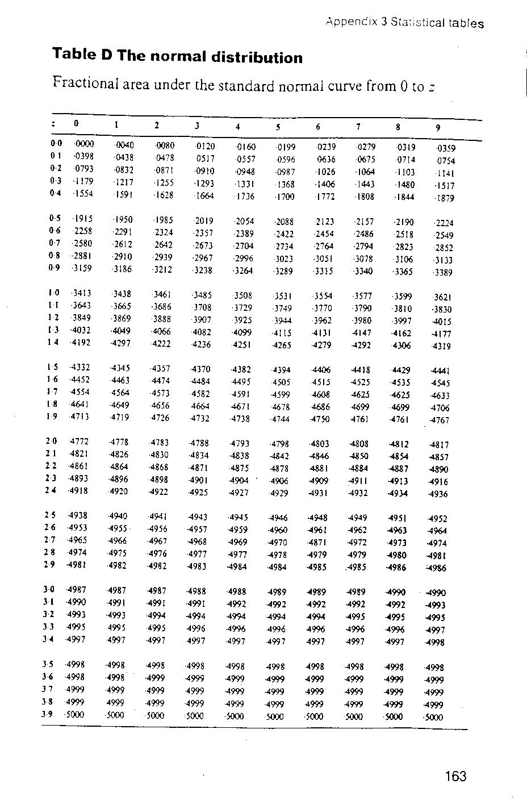
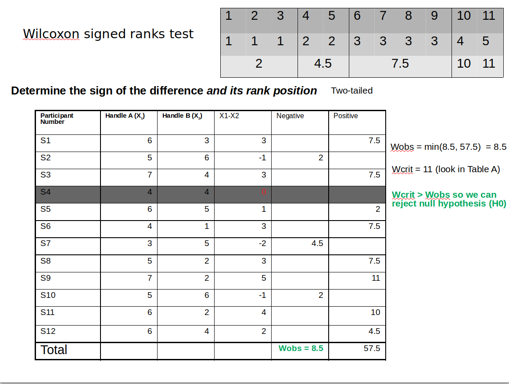
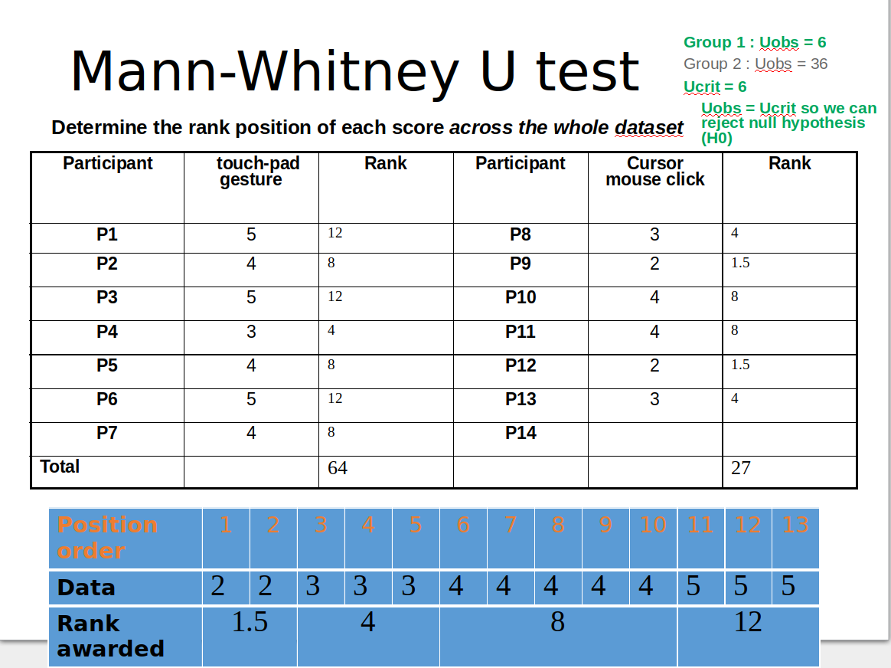

# Studying Human Performance

### Introduction lecture (02/10/2018)

> Homework for **09/10/28**:  Workbook Chapters 2, 3 and 4

### Lecture (05/10/2018)

Chapter 1 Evaluation of HW

### Lecture (09/10/2018)

#### Variance (S²)

$$
S^2 = \frac{\sum (x - \bar{x})^2}{N - 1}
$$

#### Standard Deviation (SD)

> Perfect description of an entire distribution

$$
S = \sqrt{\frac{\sum (x - \bar{x})^2}{N - 1}}
$$

#### Z scores

> Used to perform calculations on normally distributed data
> A **Z score** is the distance from the mean measured in units of Standard Deviation

$$
Z = \frac{x - \bar{x}}{SD}
$$

> Homework for **16/10/2018**: Workbook Chapter 5

### Lecture (16/10/2018)

#### WB 5.8: Experimental design discussion activity

- **IV**: Various pieces of information about the employees ; Task difficulty ; Attitude measure accuracy
- **DV**: Attitude score ; Time to complete Task
- **H1**: The training scheme has an impact on the operators' performances
- **H0**: The training scheme has no impact on the operators' performances
- **ST**: ANOVA

### Lecture (19/10/2018)

- Repeated measures design = Within
- Simple two-group design = between

> **TO DO**: sum up the example questions into résumé
> **TO DO**: Coursework 1 due **22 November 2018**

### Lecture (23/10/2018)

#### Wilcoxon

#### Mann-Whitney

